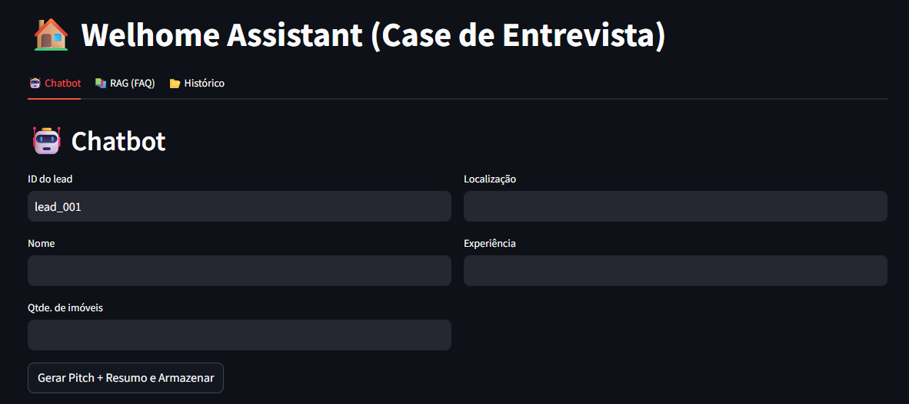
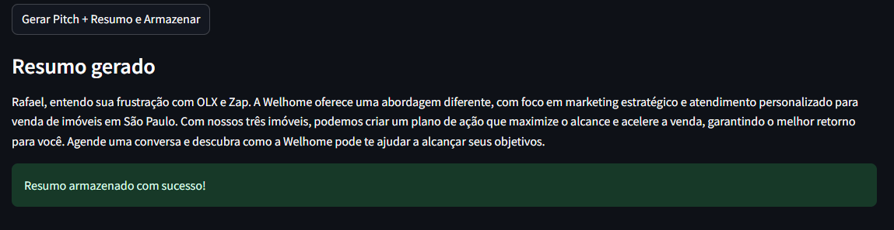
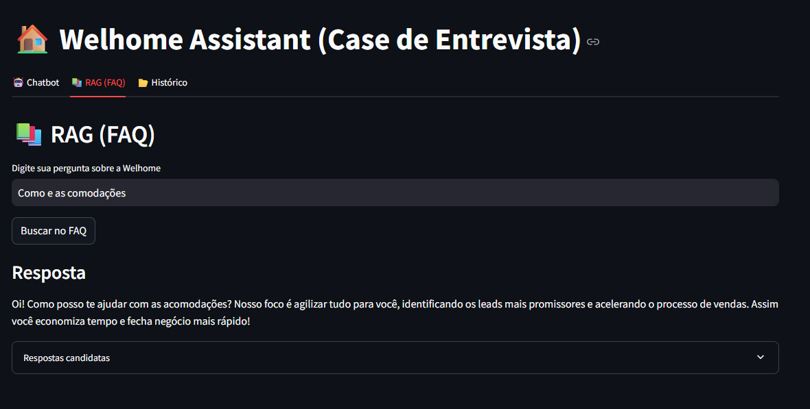
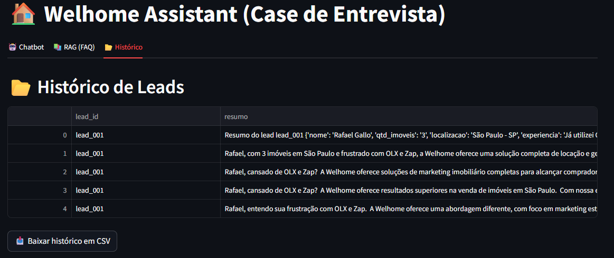
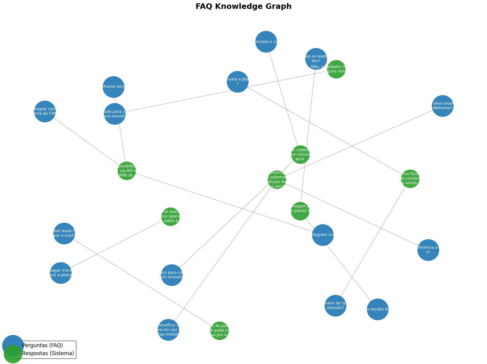

# Welhome Assistant 

[](https://www.python.org/) [](https://streamlit.io/) [](https://faiss.ai/) [](https://www.sbert.net/) [](https://huggingface.co/transformers/) [](https://ai.google.dev/) [](https://matplotlib.org/) [](https://networkx.org/) [](LICENSE)


O **Welhome Assistant** é um projeto de demonstração que combina **LLMs (Gemini)**, **RAG (FAISS)** e visualização de grafos (**GraphRAG**) para oferecer um assistente inteligente de vendas.  
Ele foi desenvolvido como um **case de entrevista técnica**, demonstrando habilidades de **engenharia de prompts, integração de LLMs, RAG, e visualização de conhecimento**.

## Funcionalidades

- **Chatbot (LLM - Gemini)**  
  Gera um pitch personalizado para cada lead e cria um resumo estruturado para auxiliar vendedores.  

- **RAG (FAQ Expandido)**  
  Responde perguntas frequentes dos leads a partir de um FAQ expandido (até **1000 variações** de perguntas).  

- **Histórico de Leads**  
  Armazena interações em um banco vetorial (FAISS) e permite exportar para **CSV**.  

- **GraphRAG**  
  Gera um **grafo de conhecimento** que conecta perguntas e respostas do FAQ, facilitando a visualização.  

## Estrutura do Projeto

```

├── src/
│   ├── app_streamlit.py      # Interface principal (Streamlit)
│   ├── app_cli.py            # Interface de linha de comando
│   ├── rag_store.py          # Vetorstore (FAISS)
│   ├── LLM_model.py          # Wrapper para Gemini + embeddings
│   └── expand_faq.py         # Script para expandir FAQ
│
├── data/
│   ├── faq.json              # FAQ original
│   └── faq_expandido.json    # FAQ expandido (até 1000 frases)
│
├── py/
│   └── config.py             # Configurações (.env e tokens)
│
├── img/
│   ├── 001.png               # Tela inicial (Chatbot)
│   ├── 002.png               # Resumo gerado
│   ├── 003.png               # RAG (FAQ)
│   ├── 004.png               # Histórico de leads
│
├── output/
│   └── graph_LLM.png         # Grafo de conhecimento (FAQ)
│
├── requirements.txt
├── main.py                   # Launcher oficial (Streamlit)
└── README.md

````

## Instalação

### 1. Clonar o repositório
```bash
git clone https://github.com/RafaelGallo/RAG_LLM_Hub.git
cd RAG_LLM_Hub
````

### 2. Criar ambiente virtual

```bash
python -m venv agenteLLM2
agenteLLM2\Scripts\activate      # Windows
source agenteLLM2/bin/activate   # Linux/Mac
```

### 3. Instalar dependências

```bash
pip install -r requirements.txt
```

### 4. Configurar variáveis de ambiente

Crie um arquivo **`.env`** na raiz com as chaves:

```
GEMINI_API_KEY=YOUR_GEMINI_API_KEY
HUGGINGFACE_TOKEN=YOUR_HF_TOKEN
```

## Como Rodar

### Interface Web (Streamlit)

```bash
python main.py
```

A aplicação abrirá em `http://localhost:8501`.

### Interface CLI (linha de comando)

```bash
python src/app_cli.py
```

### Expandir FAQ até 1000 frases

```bash
python src/expand_faq.py
```

### Gerar Grafo (GraphRAG)

```bash
python py/graph_faq.py
```

## 📸 Demonstrações

### 1. Chatbot (Pitch + Resumo)



Essas imagens mostram a interface em Streamlit.
A primeira tela destaca o formulário de entrada de leads com campos de nome, quantidade de imóveis, localização e experiência.

### 2. Resumo Estruturado



A segunda mostra a geração automática de pitch e resumo estruturado, que pode ser usado diretamente pela equipe de vendas.
O layout é limpo, com abas para Chatbot, RAG e Histórico, facilitando o uso.

### 3. RAG (FAQ)



Demonstra a funcionalidade de busca no FAQ expandido (RAG).
O usuário faz uma pergunta, e o sistema encontra a resposta mais relevante com base nas embeddings.
Além disso, a resposta é naturalizada pelo modelo Gemini, tornando-a clara e amigável para o lead.

### 4. Histórico de Leads

 

Mostra a aba de histórico com exportação em CSV.
Cada interação com leads é salva, permitindo acompanhamento e análise de marketing posterior.
Esse recurso conecta a parte de gestão de vendas com insights automáticos.

### 5. Knowledge Graph (FAQ)



É a representação visual do grafo de conhecimento construído a partir do FAQ.
Os nós azuis representam perguntas e os nós verdes representam respostas, conectados por arestas "responde".
Esse gráfico ajuda a entender como as informações estão relacionadas e pode ser expandido para análises mais complexas de GraphRAG.

## Tecnologias Utilizadas

* **Python 3.10+**
* [Streamlit](https://streamlit.io/)
* [FAISS](https://faiss.ai/)
* [Sentence Transformers](https://www.sbert.net/)
* [Google Generative AI (Gemini)](https://ai.google.dev/)
* [Hugging Face Hub](https://huggingface.co/)
* [NetworkX](https://networkx.org/) + [Matplotlib](https://matplotlib.org/)

## 📜 Licença

MIT License © 2025 - [Rafael Gallo](https://github.com/RafaelGallo)
